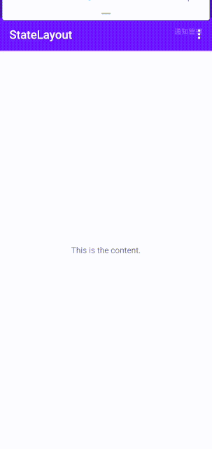

# StateLayout


## Usage

Add Gradle dependency:

```groovy
dependencies {
    implementation 'com.shouquan:StateLayout:1.0.0'
}
```

An example of usage in layout xml:

```xml
<com.shouquan.statelayout.StateLayout
    android:id="@+id/layout_state"
    android:layout_width="match_parent"
    android:layout_height="match_parent"
    app:sl_loading_view="@layout/view_loading"
    app:sl_error_view="@layout/view_error">
    
    <!-- your content here -->
    <TextView
        android:layout_width="wrap_content"
        android:layout_height="wrap_content"
        android:text="This is the content."
        android:layout_gravity="center" />

</com.shouquan.statelayout.StateLayout>
```

Switch state:

```java
setState(StateLayout.STATE_LOADING)
```

There are 3 build-in state:
* STATE_CONTENT
* STATE_LOADING
* STATE_ERROR

You can also add your own state like this:
```java
setViewForState(STATE_EMPTY, R.layout.view_empty)
```

Get the state view:
```java
getView(StateLayout.STATE_ERROR)
```

## License
```
Copyright 2020 Shouquan Wang

Licensed under the Apache License, Version 2.0 (the "License");
you may not use this file except in compliance with the License.
You may obtain a copy of the License at

   http://www.apache.org/licenses/LICENSE-2.0

Unless required by applicable law or agreed to in writing, software
distributed under the License is distributed on an "AS IS" BASIS,
WITHOUT WARRANTIES OR CONDITIONS OF ANY KIND, either express or implied.
See the License for the specific language governing permissions and
limitations under the License.
```